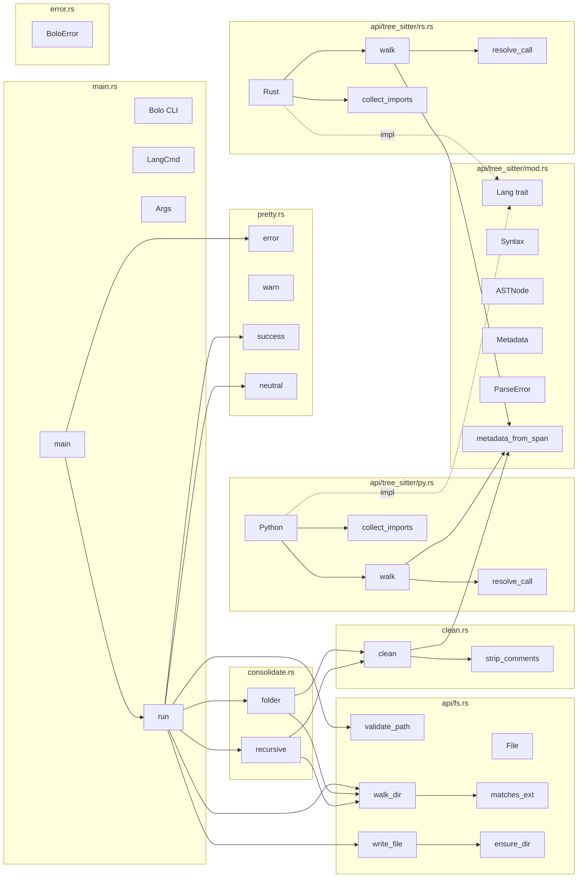

# bolo

A CLI tool that parses codebases using tree-sitter and emits dependency DAGs as JSON.

Walks source files, extracts functions, types, calls, and comments into a nested structure,
then cleans and consolidates per-file results into a single JSON array.

## Installation

**Quick install** (Linux / macOS):

```bash
curl -fsSL https://raw.githubusercontent.com/bharxhav/bolomoty/main/install.sh | bash
```

**From source:**

```bash
cargo install --git https://github.com/bharxhav/bolomoty.git
```

## Usage

```bash
bolo <COMMAND> [PATH] [OPTIONS]
```

### Commands

| Command | Language |
| ------- | -------- |
| `py`    | Python   |
| `rs`    | Rust     |

### Options

| Flag                  | Description                                  |
| --------------------- | -------------------------------------------- |
| `-o, --output <FILE>` | Output file (default: stdout)                |
| `-f, --force`         | Overwrite existing output                    |
| `--no-ignore`         | Include files ignored by `.gitignore`        |
| `--shallow`           | Only scan immediate directory                |
| `--dry-run`           | Show file count and exit                     |
| `-j, --jobs N`        | Parallel threads (default: 1, 0 = all cores) |
| `-h, --help`          | Print help                                   |
| `-V, --version`       | Print version                                |

### Dependency Graph

Generated by running `bolo rs src/` on itself.

Cross-module calls extracted from the JSON output:


